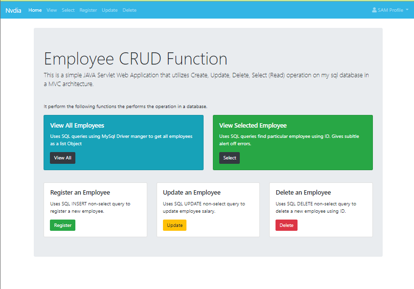

# Java-crud-app


## Description
This is Java Servlet Web Application that utilizes CRUD operations on sql database in MVC structure.

**note: can login using same name and pass. not fully configured.
## Install and Run:
To run this app in eclipse EE:
- `File` -> Open project from file system
- Select the `java-crud-app.zip`
- Right Click on project -> `Run As` -> `Run on Server`.
- It was tested on `apache tomcat 8.5`

## Functionality
This application enables the user to:
- Display all the data in table
- Register new record in database
- Update part of the record
- Delete records
- Look for particular records
- Login page (partial)

## External JAR Used
Can be found in pom.xml
- Servlet-API - TO use servlet app
- MYSQL Driver - To communicate with mysql database
- JSTL 1.2 - for jsp expressions


## Developer Notes
### The default database is created in Connectionfactory.java using the  following parameter:

```
DriverManager.getConnection("jdbc:mysql://localhost:3306/employee", "root", "root");
//username and Password are the last two parameters.
```
### The default database:
-employee
### The default table used for implementaion: 
Table name: emp.
| eid | ename | esal |
|---|---|----|
|101|Sam|1000||

###Database and table creation(SQL):
```
CREATE SCHEMA `employee` ;
```
```
CREATE TABLE `emp` (
  `eid` int NOT NULL,
  `ename` varchar(255) DEFAULT NULL,
  `esal` int DEFAULT NULL,
  PRIMARY KEY (`eid`)
)
```


## Feature Completed Since First Iteration

- Added CRUD system in MVC structure
- Styling and formatting
  - added card system for form input
  - added subtle alert system
  - Added Navigation bar
- Added error handling for invalid input
- Used Maven to create project.
- Added `login` ability.
- added login and user management using session and cookies.
